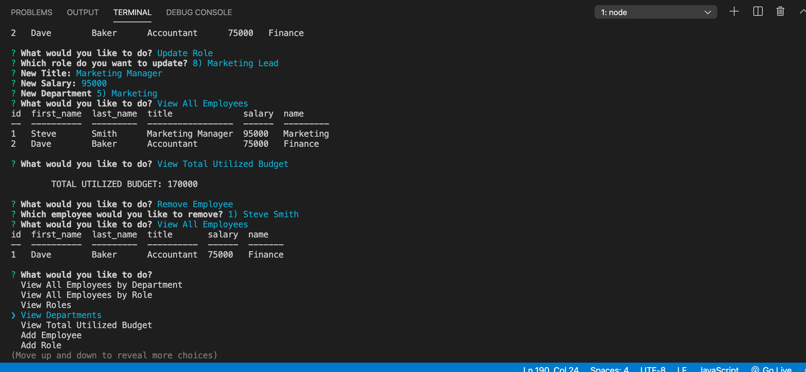

# EMPLOYEE TRACKER

## About
This is a CLI app that allows you to manage employees, roles, and departments of your company.

## Technologies Used
* MySQL
* NodeJS
* Inquirer

## Installation
Run npm i from the command line to install the needed npm packages.

## Usage
Run the program by typing node server.js in the command line, then navigate the menus by using the arrow keys and keyboard.

## Screenshots
